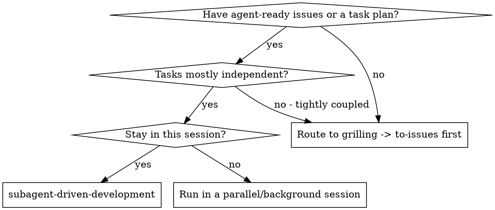
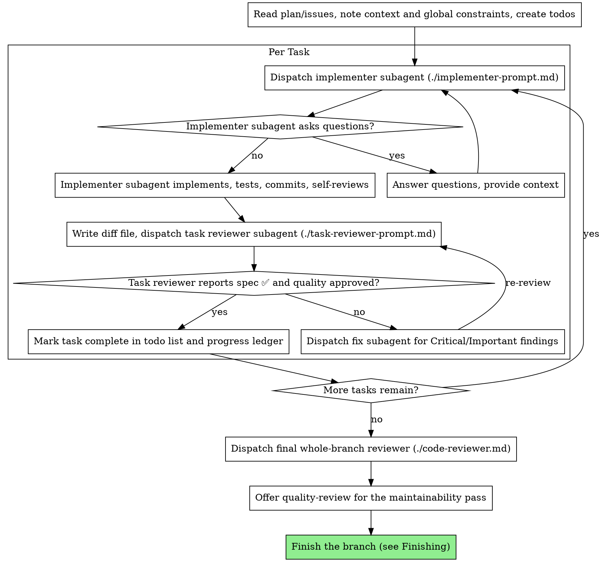

# Subagent-Driven Development

Execute a plan by dispatching a fresh implementer subagent per task, a task review (spec compliance + code quality) after each, and a broad whole-branch review at the end.

**Why subagents:** You delegate tasks to specialized agents with isolated context. By precisely crafting their instructions and context, you ensure they stay focused and succeed at their task. They should never inherit your session's context or history — you construct exactly what they need. This also preserves your own context for coordination work.

**Core principle:** Fresh subagent per task + task review (spec + quality) + broad final review = high quality, fast iteration

**Narration:** between tool calls, narrate at most one short line — the ledger and the tool results carry the record.

**Continuous execution:** Do not pause to check in with your human partner between tasks. Execute all tasks without stopping. The only reasons to stop are: BLOCKED status you cannot resolve, ambiguity that genuinely prevents progress, or all tasks complete. "Should I continue?" prompts and progress summaries waste their time — they asked you to execute the plan, so execute it.

## Input: what you execute

This skill is the **execution engine** at the end of the planning chain. The plan it executes is produced upstream by other skills, not by this one:

- **`grilling` / `grill-with-docs`** sharpen the design and resolve ambiguity.
- **`to-prd`** / **`to-issues`** turn that design into the executable unit.

The executable unit is one of two shapes — both work:

- **Issue files (preferred).** The issues under a ticket, `.scratch/<feature>/issues/<NN>-<slug>.md`, written agent-ready by `triage`. **Each issue file IS a task brief** — pass its path to the implementer directly; no extraction step. Execute them in numbered order, respecting any stated dependencies.
- **A plan file** with `## Task N` headings. Extract each task's brief with `scripts/task-brief PLAN_FILE N`.

If the input is neither — a raw idea, an un-grilled plan, tasks that are tightly coupled — stop and route the user to `grilling` → `to-issues` first. This skill does not plan.

## When to Use



**Same-session subagent execution gives you:**
- No context switch — you stay the controller
- Fresh subagent per task (no context pollution)
- Review after each task (spec compliance + code quality), broad review at the end
- Faster iteration (no human-in-loop between tasks)

## Workspace & isolation

Before Task 1:

- **Never start implementation on `main`/`master` without explicit user consent.** Work on a feature branch or, for isolation from your current workspace, a git worktree (`git worktree add` or the `EnterWorktree` tool).
- SDD's transient artifacts (implementer reports, review packages, the progress ledger; task briefs for the plan-file fallback) live under `.scratch/sdd/`, resolved by `scripts/sdd-workspace`. It self-ignores so these never pollute `git status` or get committed — the issue files themselves stay tracked.

## The Process



## Pre-Flight Plan Review

Before dispatching Task 1, scan the plan/issues once for conflicts:

- tasks that contradict each other or the plan's Global Constraints
- anything the plan explicitly mandates that the review rubric treats as a defect (a test that asserts nothing, verbatim duplication of a logic block)

Present everything you find to your human partner as one batched question — each finding beside the plan text that mandates it, asking which governs — before execution begins, not one interrupt per discovery mid-plan. If the scan is clean, proceed without comment. The review loop remains the net for conflicts that only emerge from implementation.

## Skills the subagents use

You construct each subagent's prompt, so you decide which skills it invokes. Wire them in explicitly:

- **`tdd`** — every implementer builds test-first. The implementer prompt tells the subagent to invoke `tdd`; its report carries the RED/GREEN evidence.
- **`diagnosing-bugs`** — when an implementer or fix subagent hits a hard bug it cannot crack by inspection (a failing test it doesn't understand, a regression), instruct it to run the `diagnosing-bugs` loop rather than guess-patching.
- **`codebase-design`** — for a task that turns on a real design decision (where a seam goes, an interface shape), hand the implementer the deep-module vocabulary so its choice and the reviewer's judgement share language. A task that needs design judgement *you* haven't settled is an escalation, not an implementer call — resolve it with `grilling` first.
- **`domain-modeling`** — reviewers and implementers should read `CONTEXT.md` (the domain glossary) and `docs/adr/` for the area they touch, and use that vocabulary. Don't re-litigate a settled ADR.

## Model Selection

Use the least powerful model that can handle each role — and **always specify it explicitly**. An omitted model inherits your session's, usually the most capable and expensive, silently defeating this section.

Pick the tier by the task, not the role:

| Signal | Tier |
|---|---|
| Brief carries the complete code to write, or a single-file mechanical fix (transcription plus testing) | cheapest |
| 1–2 files, complete spec | cheap |
| Multi-file integration, pattern-matching, debugging; any reviewer working from prose | standard (the mid-tier floor) |
| Design judgment or broad codebase understanding; the final whole-branch review | most capable, not the session default |
| The hardest design, or the final review of a large/subtle branch | frontier, if available |

Scale reviewer models the same way — by the diff's size, complexity, and risk: a small mechanical diff needs no capable model; a subtle concurrency change does.

**Turn count beats token price.** The cheapest models routinely take 2–3× the turns on multi-step work, costing more overall in wall-clock and context — that is why reviewers and prose-fed implementers floor at mid-tier.

**Frontier tier (opt-in, only if available — e.g. Fable).** Materially more expensive (~2× the standard top tier) and slower per turn (a request can run several minutes). Never the session default, never routine capable work; reserve it for where a missed defect or wrong seam costs more than the model. If no frontier model exists, the most-capable tier is the top and this row is a no-op.

## Handling Implementer Status

Implementer subagents report one of four statuses. Handle each appropriately:

**DONE:** Generate the review package (`scripts/review-package BASE HEAD`, run from this skill's directory — it prints the unique file path it wrote), then dispatch the task reviewer with that path. **BASE is the commit you recorded before dispatching the implementer — never `HEAD~1`, which silently drops all but the last commit of a multi-commit task.** This is the *recorded BASE*; every review range below floors on it.

**DONE_WITH_CONCERNS:** The implementer completed the work but flagged doubts. Read the concerns before proceeding. If the concerns are about correctness or scope, address them before review. If they're observations (e.g., "this file is getting large"), note them and proceed to review.

**NEEDS_CONTEXT:** The implementer needs information that wasn't provided. Provide the missing context and re-dispatch.

**BLOCKED:** The implementer cannot complete the task. Assess the blocker:
1. If it's a context problem, provide more context and re-dispatch with the same model
2. If the task requires more reasoning, re-dispatch with a more capable model
3. If the blocker is a bug the implementer can't crack, re-dispatch it with instructions to run the `diagnosing-bugs` loop
4. If the task is too large, break it into smaller pieces
5. If the plan itself is wrong, escalate to the human

**Never** ignore an escalation or force the same model to retry without changes. If the implementer said it's stuck, something needs to change.

## Handling Reviewer ⚠️ Items

The task reviewer may report "⚠️ Cannot verify from diff" items — requirements that live in unchanged code or span tasks. These do not block the rest of the review, but you must resolve each one yourself before marking the task complete: you hold the plan and cross-task context the reviewer lacks. If you confirm an item is a real gap, treat it as a failed spec review — send it back to the implementer and re-review.

## Constructing Reviewer Prompts

Per-task reviews are task-scoped gates. The broad review happens once, at the final whole-branch review. When you fill a reviewer template:

- Do not add open-ended directives like "check all uses" or "run race tests if useful" without a concrete, task-specific reason
- Do not ask a reviewer to re-run tests the implementer already ran on the same code — the implementer's report carries the test evidence
- Do not pre-judge findings for the reviewer — never instruct a reviewer to ignore or not flag a specific issue. If you believe a finding would be a false positive, let the reviewer raise it and adjudicate it in the review loop. If the prompt you are writing contains "do not flag," "don't treat X as a defect," "at most Minor," or "the plan chose" — stop: you are pre-judging, usually to spare yourself a review loop.
- The global-constraints block you hand the reviewer is its attention lens. Copy the binding requirements verbatim from the plan's Global Constraints section or the issue: exact values, exact formats, and the stated relationships between components ("same layout as X", "matches Y"). The reviewer's template already carries the process rules (YAGNI, test hygiene, review method) — the constraints block is for what THIS project's spec demands.
- Hand the reviewer its diff as a file: run this skill's `scripts/review-package BASE HEAD` and pass the reviewer the file path it prints (or, without bash: `git log --oneline`, `git diff --stat`, and `git diff -U10` for the range, redirected to one uniquely named file). The output never enters your own context, and the reviewer sees the commit list, stat summary, and full diff with context in one Read call. Use the *recorded BASE*, never `HEAD~1`.
- A dispatch prompt describes one task, not the session's history. Do not paste accumulated prior-task summaries ("state after Tasks 1-3") into later dispatches — a real session's dispatch hit 42k chars of which 99% was pasted history. A fresh subagent needs its task, the interfaces it touches, and the global constraints. Nothing else.
- Dispatch fix subagents for Critical and Important findings. Record Minor findings in the progress ledger as you go, and point the final whole-branch review at that list so it can triage which must be fixed before merge. A roll-up nobody reads is a silent discard.
- A finding labeled plan-mandated — or any finding that conflicts with what the plan's text requires — is the human's decision, like any plan contradiction: present the finding and the plan text, ask which governs. Do not dismiss the finding because the plan mandates it, and do not dispatch a fix that contradicts the plan without asking.
- The final whole-branch review gets a package too: run `scripts/review-package MERGE_BASE HEAD` (MERGE_BASE = the commit the branch started from, e.g. `git merge-base main HEAD`) and include the printed path in the final review dispatch, so the final reviewer reads one file instead of re-deriving the branch diff with git commands.
- Every fix dispatch carries the implementer contract: the fix subagent re-runs the tests covering its change and reports the results. Name the covering test files in the dispatch — a one-line fix does not need the whole suite. Before re-dispatching the reviewer, confirm the fix report contains the covering tests, the command run, and the output; dispatch the re-review once all three are present.
- If the final whole-branch review returns findings, dispatch ONE fix subagent with the complete findings list — not one fixer per finding. Per-finding fixers each rebuild context and re-run suites; a real session's final-review fix wave cost more than all its tasks combined.

## File Handoffs

Everything you paste into a dispatch prompt — and everything a subagent prints back — stays resident in your context for the rest of the session and is re-read on every later turn. Hand artifacts over as files:

- **Task brief:** for an issue, the brief is the issue file itself (`.scratch/<feature>/issues/<NN>-<slug>.md`) — pass its path. For the plan-file fallback, run this skill's `scripts/task-brief PLAN_FILE N` — it extracts the task's full text to a uniquely named file and prints the path. Compose the dispatch so the brief stays the single source of requirements. Your dispatch should contain: (1) one line on where this task fits in the project; (2) the brief path, introduced as "read this first — it is your requirements, with the exact values to use verbatim"; (3) interfaces and decisions from earlier tasks that the brief cannot know; (4) your resolution of any ambiguity you noticed in the brief; (5) the report-file path and report contract. Exact values (numbers, magic strings, signatures, test cases) appear only in the brief.
- **Report file:** name the implementer's report file in `.scratch/sdd/` after the task (e.g. `task-N-report.md`, or `<issue-slug>-report.md`) and put it in the dispatch prompt. The implementer writes the full report there and returns only status, commits, a one-line test summary, and concerns.
- **Reviewer inputs:** the task reviewer gets three paths — the brief (issue file or extracted brief), the report file, and the review package — plus the global constraints that bind the task.
- Fix dispatches append their fix report (with test results) to the same report file and return a short summary; re-reviews read the updated file.

## Durable Progress

Conversation memory does not survive compaction. In real sessions, controllers that lost their place have re-dispatched entire completed task sequences — the single most expensive failure observed. Track progress in a ledger file, not only in todos.

- At skill start, check for a ledger: `cat "$(git rev-parse --show-toplevel)/.scratch/sdd/progress.md"`. Tasks listed there as complete are DONE — do not re-dispatch them; resume at the first task not marked complete.
- When a task's review comes back clean, append one line to the ledger in the same message as your other bookkeeping: `Task N (<issue-slug>): complete (commits <base7>..<head7>, review clean)`.
- The ledger is your recovery map: the commits it names exist in git even when your context no longer remembers creating them. After compaction, trust the ledger and `git log` over your own recollection.
- For a long run that is about to compact, use the `handoff` skill to capture controller state (which tasks are done, the branch, the ledger path) for the next session.
- `git clean -fdx` will destroy the ledger (it's git-ignored scratch); if that happens, recover from `git log`.

## Finishing

After the final whole-branch review comes back clean (and any final-review fixes are merged):

1. **Maintainability pass (offer):** the whole-branch reviewer checks correctness and spec compliance; it does not do the strict structural audit. Offer to run the user-invoked **`quality-review`** skill on the branch for the maintainability/code-judo pass. It produces a shareable HTML report and is the right final gate before merge on non-trivial branches.
2. **Integrate:** present the integration options — merge to the base branch, open a PR, or leave the branch for the user. Follow the repo's commit/PR conventions. Do not merge or push without the user's go-ahead.
3. **Tracker:** update the executed issues' `Status:` line if the project's `triage` flow expects it, and record the final ledger line.

## Prompt Templates

- [implementer-prompt.md](implementer-prompt.md) — Dispatch implementer subagent (builds test-first via `tdd`)
- [task-reviewer-prompt.md](task-reviewer-prompt.md) — Dispatch task reviewer subagent (spec compliance + code quality)
- [code-reviewer.md](code-reviewer.md) — Dispatch the final whole-branch correctness/spec reviewer; pair with `quality-review` for maintainability

## Example Workflow

```
You: I'm using Subagent-Driven Development to execute the issues under
     .scratch/payment-plan/.

[Read the issues once; check .scratch/sdd/progress.md for prior progress]
[Create todos for all issues]

Issue 01: Hook installation script

[Dispatch implementer with the issue path as its brief + report path + context]

Implementer: "Before I begin - should the hook be installed at user or system level?"

You: "User level (~/.config/.../hooks/)"

Implementer: "Got it. Implementing now..."
[Later] Implementer:
  - Implemented install-hook command (test-first via tdd)
  - Added tests, 5/5 passing, RED/GREEN evidence in report
  - Self-review: Found I missed --force flag, added it
  - Committed

[Run review-package, dispatch task reviewer with the printed path]
Task reviewer: Spec ✅ - all requirements met, nothing extra.
  Strengths: Good test coverage, clean. Issues: None. Task quality: Approved.

[Mark Issue 01 complete in the ledger]

Issue 02: Recovery modes

[Dispatch implementer with the issue path + report path + context]
Implementer: [No questions, proceeds]
  - Added verify/repair modes, 8/8 passing
  - Committed

[Run review-package, dispatch task reviewer]
Task reviewer: Spec ❌:
  - Missing: Progress reporting (issue says "report every 100 items")
  - Extra: Added --json flag (not requested)
  Issues (Important): Magic number (100)

[Dispatch fix subagent with all findings]
Fixer: Removed --json flag, added progress reporting, extracted PROGRESS_INTERVAL

[Task reviewer reviews again]
Task reviewer: Spec ✅. Task quality: Approved.

[Mark Issue 02 complete]

...

[After all issues: dispatch final whole-branch code-reviewer]
Final reviewer: All requirements met, ready to merge

[Offer quality-review for the maintainability pass; then finish the branch]
Done!
```

## Red Flags

**Never:**
- Start implementation on main/master branch without explicit user consent
- Skip task review, or accept a report missing either verdict (spec compliance AND task quality are both required)
- Proceed with unfixed issues
- Dispatch multiple implementation subagents in parallel (conflicts)
- Make a subagent read the whole plan file (hand it its issue file or `scripts/task-brief` extract instead)
- Skip scene-setting context (subagent needs to understand where task fits)
- Ignore subagent questions (answer before letting them proceed)
- Accept "close enough" on spec compliance (reviewer found spec issues = not done)
- Skip review loops (reviewer found issues = implementer fixes = review again)
- Let implementer self-review replace actual review (both are needed)
- Tell a reviewer what not to flag, or pre-rate a finding's severity in the dispatch prompt ("treat it as Minor at most")
- Dispatch a task reviewer without a diff file — generate it first (`scripts/review-package BASE HEAD`) and name the printed path in the prompt
- Move to next task while the review has open Critical/Important issues
- Re-dispatch a task the progress ledger already marks complete — check the ledger (and `git log`) after any compaction or resume
- Plan inside this skill — if the input isn't agent-ready, route to `grilling` → `to-issues`
